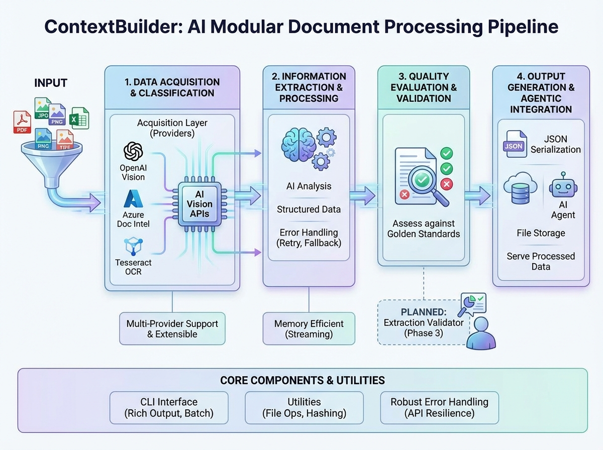

# 🦉 ContextBuilder

[](https://opensource.org/licenses/MIT)
[](https://www.python.org/downloads/)
[](https://reactjs.org/)
[](https://fastapi.tiangolo.com/)

**Insurance claims document processing pipeline** that ingests, classifies, extracts, and enables human QA labeling of documents. Built with modularity and extensibility in mind.

<p align="center">
  
</p>

## 🦉 What is ContextBuilder?

ContextBuilder is an end-to-end document processing system designed for insurance claims workflows:

1. **Ingests** documents (PDFs, images, text) via Azure Document Intelligence or OpenAI Vision
2. **Classifies** document types using a catalog-driven AI router (LOB-agnostic)
3. **Extracts** structured fields with provenance tracking and quality gates
4. **Enables** human QA labeling via a React-based console

**Tech Stack:**
- **Backend**: Python 3.9+, FastAPI, OpenAI/Azure APIs, Pydantic
- **Frontend**: React 18, TypeScript, Tailwind CSS, Vite
- **Storage**: File-based JSON with JSONL indexes (no database required)

---

## 🚀 Quick Start

### Installation

```bash
# Clone the repository
git clone https://github.com/Fr3nn3r/AgenticContextBuilder.git
cd AgenticContextBuilder

# Install Python dependencies using uv (recommended)
uv pip install -e .

# Or using pip
pip install -e .

# Install frontend dependencies
cd ui && npm install && cd ..
```

### Configuration

Create a `.env` file in the project root:

```env
# Required for classification and extraction
OPENAI_API_KEY=sk-...

# Optional: Azure Document Intelligence for ingestion
AZURE_DI_ENDPOINT=https://your-resource.cognitiveservices.azure.com/
AZURE_DI_API_KEY=...
```

### 🦉 Run the Pipeline

```bash
# Process claims from a folder
python -m context_builder.cli pipeline claims_folder/ -o output/claims

# Dry-run to see what would be processed
python -m context_builder.cli pipeline claims_folder/ -o output/claims --dry-run

# Use a specific model
python -m context_builder.cli pipeline claims_folder/ -o output/claims --model gpt-4o
```

### Start the QA Console

```bash
# Terminal 1: Start the API backend
cd src/context_builder
uvicorn api.main:app --reload --port 8000

# Terminal 2: Start the React frontend
cd ui
npm run dev
```

Open http://localhost:5173 to access the QA Console.

---

## 🏗️ Architecture 🦉

```
┌─────────────────────────────────────────────────────────────────┐
│                        INPUT DOCUMENTS                          │
│                   (PDFs, Images, Text files)                    │
└─────────────────────────────────────────────────────────────────┘
                              │
                              ▼
┌─────────────────────────────────────────────────────────────────┐
│ PIPELINE (src/context_builder/pipeline/)                        │
│  discovery.py → run.py → stages.py → writer.py → paths.py → text.py → state.py          │
└─────────────────────────────────────────────────────────────────┘
                              │
        ┌─────────────────────┼─────────────────────┐
        ▼                     ▼                     ▼
┌───────────────┐   ┌─────────────────┐   ┌─────────────────┐
│   INGESTION   │   │ CLASSIFICATION  │   │   EXTRACTION    │
│   (impl/)     │   │(classification/)│   │  (extraction/)  │
├───────────────┤   ├─────────────────┤   ├─────────────────┤
│ Azure DI      │   │ OpenAI Router   │   │ GenericExtractor│
│ OpenAI Vision │   │ Doc Type Catalog│   │ Field Specs     │
│ Tesseract     │   │ Language Detect │   │ Quality Gates   │
└───────────────┘   └─────────────────┘   └─────────────────┘
                              │
                              ▼
┌─────────────────────────────────────────────────────────────────┐
│ OUTPUT: output/claims/{claim_id}/                               │
│  ├─ docs/{doc_id}/meta/, text/, source/, labels/                │
│  └─ runs/{run_id}/extraction/, context/, logs/                  │
└─────────────────────────────────────────────────────────────────┘
                              │
                              ▼
┌─────────────────────────────────────────────────────────────────┐
│ QA CONSOLE (api/ + ui/)                                         │
│  FastAPI Backend → React Frontend (Claim Workspace)             │
└─────────────────────────────────────────────────────────────────┘
```

---

## 📁 Output Structure 🦉

```
output/
├── claims/{claim_id}/
│   ├── docs/{doc_id}/
│   │   ├── source/           # Original files (PDF, images)
│   │   ├── text/pages.json   # Extracted text per page
│   │   ├── meta/doc.json     # Document metadata
│   │   └── labels/latest.json # Human QA labels (run-independent)
│   └── runs/{run_id}/
│       ├── manifest.json     # Run metadata (git, versions, timing)
│       ├── extraction/{doc_id}.json  # Extraction results
│       ├── context/{doc_id}.json     # Classification context
│       ├── logs/summary.json         # Run summary
│       └── .complete                  # Marker file
├── runs/{run_id}/            # Global run metadata
│   ├── manifest.json
│   ├── summary.json
│   └── metrics.json
└── registry/                 # JSONL indexes for fast lookups
    ├── doc_index.jsonl
    ├── label_index.jsonl
    └── run_index.jsonl
```

---

## 🛠️ CLI Commands

### `pipeline` - Main Processing Command

```bash
# Process all claims in a folder
python -m context_builder.cli pipeline <input_path> -o <output_dir> [options]

# Options:
#   --model MODEL      LLM model (default: gpt-4o)
#   --run-id ID        Custom run ID (default: auto-generated)
#   --stages STAGES    Comma-separated: ingest,classify,extract (default: all)
#   --force            Overwrite existing run folder
#   --dry-run          Preview what would be processed
#   --no-metrics       Skip metrics computation
#   -v, --verbose      Enable verbose logging
```

### `acquire` - Document Ingestion (Legacy)

```bash
# Ingest documents using different providers
python -m context_builder.cli acquire <input_path> -p <provider> -o <output_dir>

# Providers:
#   azure-di   - Azure Document Intelligence (recommended)
#   openai     - OpenAI Vision API
#   tesseract  - Local OCR (no API key required)
```

### `index` - Build Search Indexes

```bash
# Rebuild JSONL indexes for fast lookups
python -m context_builder.cli index build --root output
```

---

## 🖥️ QA Console 🦉

The QA Console is a React-based interface for reviewing and labeling document extractions.

### Features

- **Claims Workspace**: Browse claims with filtering by run, doc type, gate status
- **Extraction Review**: Split-view for labeling fields (keyboard shortcuts: 1/2/3, n/p)
- **Classification Review**: Verify AI-predicted document types
- **Insights Dashboard**: Run metrics, accuracy rates, priority improvements
- **PDF Viewer**: Side-by-side document viewing with bounding box overlays

### Key Screens

| Screen | Purpose |
|--------|---------|
| `/` | Claims list with KPIs and Document Pack Queue |
| `/claims/:id` | Claim-level review with doc navigation |
| `/docs/:id` | Extraction review with field labeling |
| `/classification` | Document type review queue |
| `/insights` | Metrics dashboard with run comparison |
| `/templates` | View extraction field specifications |

### API Endpoints

| Endpoint | Description |
|----------|-------------|
| `GET /api/claims` | List claims with run-scoped metrics |
| `GET /api/claims/:id/docs` | List documents for a claim |
| `GET /api/docs/:id` | Get document with extraction & labels |
| `POST /api/docs/:id/labels` | Save human QA labels |
| `GET /api/insights/overview` | Dashboard KPIs |
| `GET /api/insights/runs` | List all extraction runs |

---

## 📋 Document Types 🦉

ContextBuilder uses a **catalog-driven classification** system. All document types are LOB-agnostic (work across motor, travel, health, etc.):

| Doc Type | Description |
|----------|-------------|
| `fnol_form` | First notice of loss, claim reports |
| `insurance_policy` | Policy documents with coverage details |
| `police_report` | Official police/law enforcement reports |
| `invoice` | Invoices, receipts, bills |
| `id_document` | ID cards, passports, driver's licenses |
| `vehicle_registration` | Vehicle registration/title documents |
| `certificate` | Official certificates and attestations |
| `medical_report` | Medical documentation, doctor's reports |
| `travel_itinerary` | Flight/hotel bookings, trip confirmations |
| `customer_comm` | Customer emails, letters, correspondence |
| `supporting_document` | Catch-all for other documents |

See `src/context_builder/extraction/specs/doc_type_catalog.yaml` for the full catalog.

---

## 📊 Key Data Structures

### ExtractionResult (per document, per run)

```json
{
  "schema_version": "extraction_result_v1",
  "run": { "run_id", "model", "extractor_version" },
  "doc": { "doc_id", "doc_type", "confidence", "language" },
  "fields": [{
    "name": "claim_number",
    "value": "CLM-12345",
    "normalized_value": "CLM-12345",
    "confidence": 0.95,
    "status": "present",
    "provenance": [{ "page": 1, "char_start": 100, "char_end": 110 }]
  }],
  "quality_gate": { "status": "pass", "missing_required_fields": [] }
}
```

### LabelResult (human QA output)

```json
{
  "schema_version": "label_v3",
  "doc_id": "doc_abc123",
  "claim_id": "CLM-12345",
  "review": { "reviewer": "john", "reviewed_at": "2024-01-15T10:30:00Z" },
  "field_labels": [
    { "field_name": "claim_number", "judgement": "correct" }
  ],
  "doc_labels": { "doc_type_correct": true }
}
```

---

## 🧩 Key Modules

### Backend (`src/context_builder/`)

| Module | Purpose |
|--------|---------|
| `pipeline/` | Orchestration: discovery, stage runner, run management, metrics |
| `impl/` | Ingestion providers (Azure DI, OpenAI, Tesseract) |
| `classification/` | Document type classification with catalog |
| `extraction/` | Field extraction with specs and quality gates |
| `schemas/` | Pydantic models (ExtractionResult, Label, etc.) |
| `api/` | FastAPI backend for QA Console |
| `storage/` | File storage with JSONL index support |

### Frontend (`ui/src/`)

| Component | Purpose |
|-----------|---------|
| `ClaimsTable.tsx` | Claims list with filtering and KPIs |
| `DocReview.tsx` | Split-view extraction review |
| `FieldsTable.tsx` | Field labeling with keyboard shortcuts |
| `PageViewer.tsx` | Document text with provenance highlighting |
| `PDFViewer.tsx` | PDF rendering with bounding boxes |
| `InsightsPage.tsx` | Metrics dashboard |
| `ClassificationReview.tsx` | Doc type verification |

---

## 🧪 Development 🦉

### Running Tests

```bash
# Backend tests
pytest tests/ -v

# With coverage
pytest tests/ --cov=context_builder --cov-report=html

# Frontend E2E tests
cd ui && npm run test:e2e
```

Windows note: if pytest temp dirs hit permission errors, run with the tmpdir plugin disabled:
```bash
python -m pytest -v -p no:tmpdir -o cache_dir=output/.pytest_cache
```

### Project Structure

```
AgenticContextBuilder/
├── src/context_builder/
│   ├── api/              # FastAPI backend
│   ├── classification/   # Document type classification
│   ├── extraction/       # Field extraction
│   │   ├── extractors/   # Extractor implementations
│   │   └── specs/        # YAML field specifications
│   ├── impl/             # Ingestion providers
│   ├── pipeline/         # Orchestration
│   ├── prompts/          # Jinja2 prompt templates
│   ├── schemas/          # Pydantic models
│   ├── storage/          # File storage & indexes
│   └── utils/            # Helpers
├── ui/                   # React frontend
│   └── src/components/   # UI components
├── tests/                # Test suites
├── output/               # Processing output (gitignored)
└── pyproject.toml        # Python dependencies
```

---

## 🦉 Glossary

| Term | Definition |
|------|------------|
| **Run** | Single pipeline execution with specific versions |
| **Extraction Output** | Values produced for a document in a run |
| **Quality Gate** | Run-scoped status: PASS/WARN/FAIL |
| **Label** | Human-authored ground truth for a field |
| **Provenance** | Evidence linking extracted value to source text |
| **Truth Value** | Human-authoritative correct value |
| **Accuracy** | Correct / (Correct + Incorrect + Missing) |

---

## 📄 License

This project is licensed under the MIT License - see the [LICENSE](LICENSE) file for details.

## 🤝 Contributing

Contributions are welcome! Please ensure:
1. Code follows principles in [CLAUDE.md](CLAUDE.md)
2. All tests pass
3. New features include tests
4. Documentation is updated

---

```
  ,_,
 (O,O)  🦉
 (   )
 -"-"-
```

**Made with ❤️ and 🦉 for the insurance AI community**
